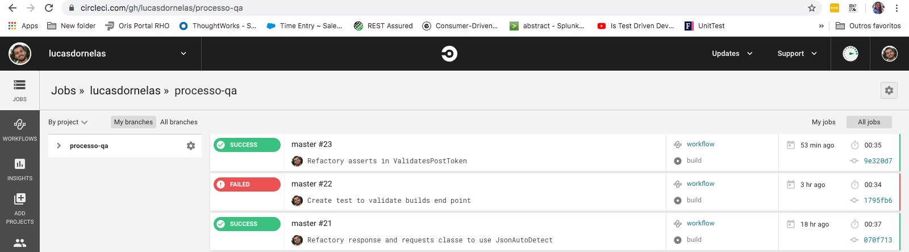

# QA Zup Process

This project contains integration tests for three micro services. In order to develop it successfully, I needed to use the following four frameworks: REST Assured, Spock, Junit4, AssertJ, Gradle and CircleCI‎.
## Getting Started

```
Install JDK
```
* [JDK](https://www.oracle.com/technetwork/pt/java/javase/downloads/jdk8-downloads-2133151.html)
```
Install Gradle
```
* [Gradle](https://gradle.org/install/)
```
```
Install Git and configure Github
```
* [Git](https://help.github.com/pt/github/getting-started-with-github/set-up-git)
```
Install IntelliJ or another IDE of your choice
```
* [IntelliJ](https://www.jetbrains.com/pt-br/idea/download/#section=mac)
```
Clone Git Project
```
* [Clone Project](https://github.com/lucasdornelas/processo-qa)
```
Open IntelliJ and import project
```
* [Import Project](https://www.jetbrains.com/help/idea/gradle.html)
```
Export these PATHs in your bash_profile to run local tests

export USER=""
export PASSWORD=""

obs: The username and password are not in the code for security reasons
```

## Running the tests

To run the tests through the IDE, you should open the directory 'groovy/specs/' and click on the right button, then click Run Test in Spec
as shown as in the image below:


To run the tests through Gradlew or Docker, you must use the Makefile, a file that is located at the root of the project. Makefile configures the way to run the tests through Gradle as shown as in the image below, for this you need to write in your terminal, as shown in the figure below:
```
make integrationTest
```


### And coding style tests

The tests were developed using the REST Assured, Spock specification framework, Junit4, AssertJ. Groovy was chosen as the language of development.

#### REST Assured 

The choice of REST Assured is based  in this topics. Removes the need for writing a lot of boilerplate code required to set up an HTTP connection and since REST Assured is a Java library, integrating it into a continuous integration / continuous delivery setup is a breeze, especially when combined with a Java testing framework such as JUnit, TestNG Groovy and Spok
* [REST Assured](http://rest-assured.io/) - The framework used to make HTTP Requests

### AssertJ

As an assert library was chosen AssertJ for having a better legibility in way its asserts are built. It also transmits the error mesages clearly.
* [AssertJ](https://joel-costigliola.github.io/assertj/) - The assert framework used

### CircleCI‎
All tests are configured to run in CircleCi, the choise for CircleCi in this case is because  is fast and simple to configure
You need follow projects, to acess CircleCI. Team members can join CircleCI by signing up with their corresponding VCS credentials on 
* https://circleci.com/signup/.

* [CircleCI‎](https://circleci.com/gh/lucasdornelas/processo-qa) - The CI used


## To Improvements

#### Tests
There was a so difficulty in writing the tests, as there is no knowledge about the endpoints and their purpose, so it was extremely difficult to writing the test for the endpoints. A more in-depth analysis of the business and micro services can end the doubts, enabling the exploration of new test scenarios.

## Authors 

* **Lucas Moura Dornelas** 
